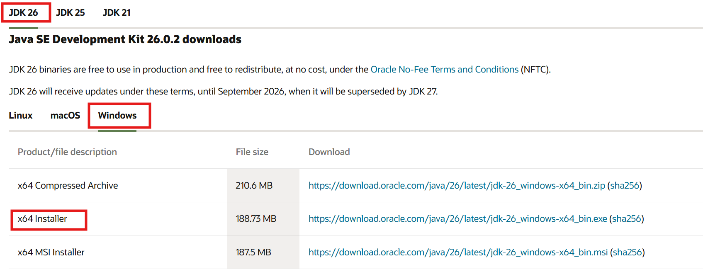
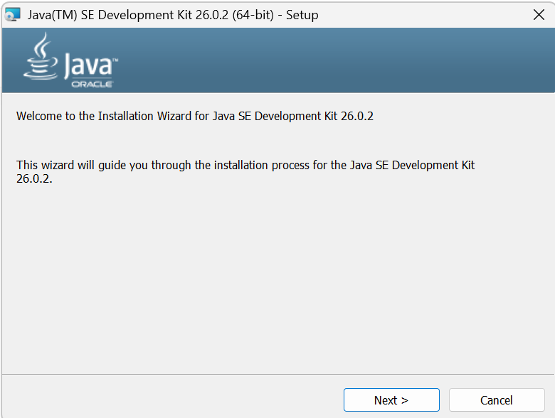
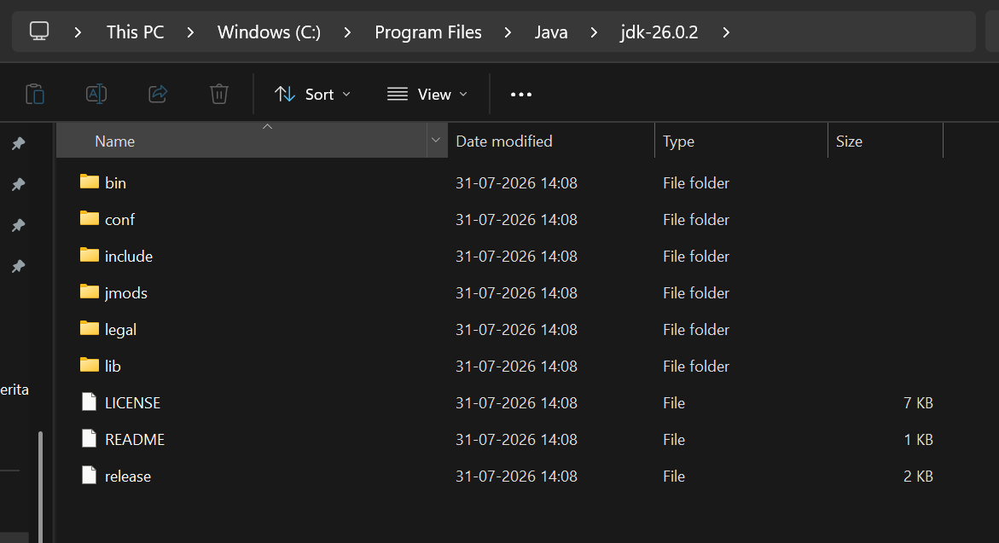
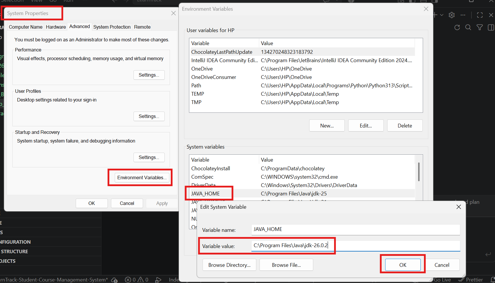
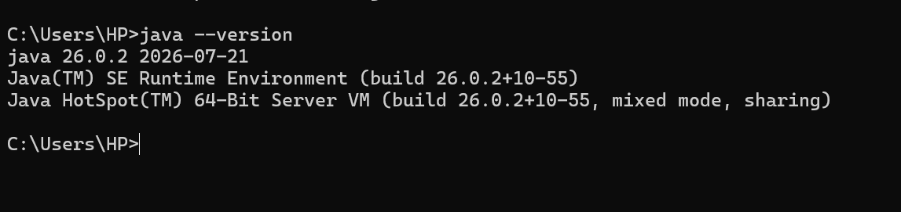
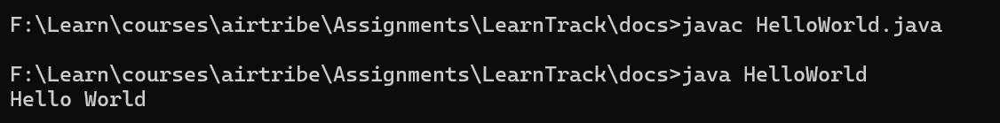

# Environment Setup

1. Go to [Oracle Java Download Page](https://www.oracle.com/in/java/technologies/downloads/)

2. Select the JDK version, I will be downloading JDK 26 for windows x64 installer as shown in the image below



3. Once the installer is downloaded, double click on the .exe file.
It will open the installation wizard, keep most of the things default and click next.



4. By default, it jdk files be will be located at `C:\Program Files\Java\jdk-26.0.2`. Check if your java home in environment variable is pointing to the correct version.



5. Set up the Environment Variable JAVA_HOME properly, System Properties -> Environment Varaible -> Under System Variable -> Click JAVA_HOME -> Set Variable Name `C:\Program Files\Java\jdk-26.0.2`



6. check java verison in cmd using `java --version`



7. create a simple `helloWorld.java` file with below code

```
public class HelloWorld {
   public static void main(String[] var0) {
      System.out.println("Hello World");
   }
}
```

8. Run these command to run the java code through cmd
    a. Compile using - `javac HelloWorld.java`
    b. Run using - `java HelloWorld`


