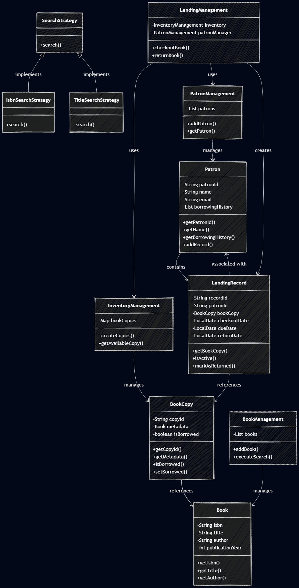

# Library Management System

## Overview
This is a simple Library Management System built in Java. It helps manage books, patrons, and book lending operations in a library.

## Features
- **Book Management**: Add and search books by ISBN, title, or author
- **Patron Management**: Register library patrons and track their information
- **Inventory Management**: Create and manage multiple copies of books
- **Lending Management**: Checkout and return books, track borrowing history
- **Notifications**: Send email notifications to patrons
- **Search Strategies**: Flexible search using different strategies (ISBN, Title, Author)

## How to Run
1. Make sure you are in the project's root folder (LibraryManagementSystem).

2. Run this command to create a bin folder and compile everything into it.
    ```
    javac -d bin src/main/java/main.java src/main/java/entity/*.java src/main/java/managers/*.java src/main/java/services/*.java src/main/java/services/impl/*.java
    ```
3. Once your files are compiled into the bin directory, you must point the classpath (-cp) to that folder to run it
    ```
    java -cp bin main
    ```

## Class Diagram
The relationships between classes are shown below:



